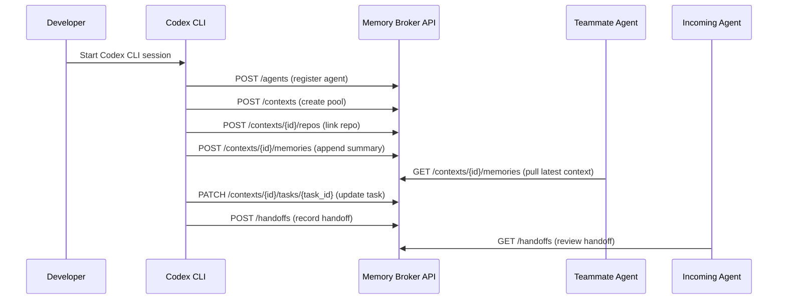
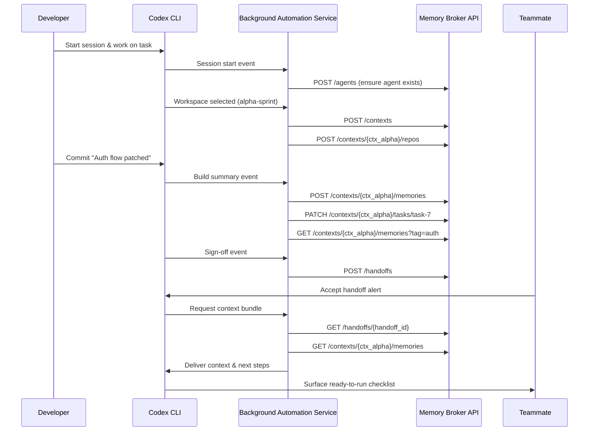

Agent Memory Broker (Codex CLI Plugin Layer)

Overview
- Modular memory broker to manage shared, long-term context for multi-agent, multi-repo collaboration.
- Designed to work alongside Codex CLI by exposing a simple HTTP API (OpenAPI-described) so any agent or human can join a shared context pool, append/query memory, and hand off tasks.

Quick Start
1) Python 3.10+
2) Install deps: pip install -r requirements.txt
3) Run server: uvicorn memory_broker.main:app --reload --port 7070
4) Open API docs: http://localhost:7070/docs

Key Concepts
- Agent: A human or automated agent participating in collaboration
- Context Pool: A named workspace shared by a team; associates repos, tasks, and memories
- Memory Item: Structured note/event (who/when/what/refs) stored with tags for recall
- Handoff: Explicit transfer of task ownership between agents with a summary + pointers

HTTP API Summary
- POST /agents: register an agent
- GET /agents: list agents
- POST /contexts: create a context pool
- GET /contexts: list context pools
- POST /contexts/{id}/memories: append memory
- GET /contexts/{id}/memories: list/query memories
- POST /contexts/{id}/repos: link a repo reference
- POST /contexts/{id}/tasks: create task
- PATCH /contexts/{id}/tasks/{task_id}: update task
- POST /handoffs: record a handoff (links agents, task, context)

Storage
- In-memory (default) for hackathon speed
- Optional JSON-file store for lightweight persistence (see MEMORY_BROKER_STORAGE and MEMORY_BROKER_DATA_PATH)

Codex CLI Integration
- Use HTTP calls to read/write shared context during a session.
- Example flows:
  - On start, Codex registers as an Agent and picks/creates a Context Pool for the project.
  - After completing a step, Codex appends a Memory Item with summary, file refs, and links.
  - On task handoff, Codex creates a Handoff record with an actionable next-step summary.

Example: brokerctl (Dev Helper)
- scripts/brokerctl.py offers quick add/list commands against the API for humans.
  - python scripts/brokerctl.py agents add --name "Alice"
  - python scripts/brokerctl.py contexts create --name "hackathon-9-27"
  - python scripts/brokerctl.py memories add --context hackathon-9-27 --author Alice --text "Initial scaffolding done"

Configuration
- MEMORY_BROKER_STORAGE: memory (default) | json
- MEMORY_BROKER_DATA_PATH: path to a folder for JSON persistence (default: ./data)

OpenAPI
- A static OpenAPI document is included at openapi.yaml and served at /openapi.json at runtime.

License
- Hackathon prototype. Use at your own risk.

## Example Collaboration Flow

The steps below illustrate how agents and humans cooperate through the memory broker during a typical handoff.

- Developer starts a Codex CLI session.
- Codex registers an agent with `POST /agents`.
- Codex creates a context pool via `POST /contexts`.
- Codex links the repo reference through `POST /contexts/{id}/repos`.
- Codex appends a build summary using `POST /contexts/{id}/memories`.
- A teammate pulls the latest context with `GET /contexts/{id}/memories`.
- Codex updates the active task status via `PATCH /contexts/{id}/tasks/{task_id}`.
- Codex records the structured handoff with `POST /handoffs`.
- The incoming agent reviews the handoff and continues implementation.

### Example Human Usage Flow

The outline below shows a practical session where Codex CLI’s background automation keeps the broker up to date while the developer simply works.

- Developer starts a Codex CLI session; the embedded Agent Sync service checks for an existing record and, if absent, posts `{"name": "Riley", "email": "riley@example.com"}` to `POST /agents`, receiving `201 Created` with `{ "id": "agent_riley", "name": "Riley" }` for future calls.
- When the developer selects the `alpha-sprint` workspace, the automation issues `POST /contexts` with `{"name": "alpha-sprint", "description": "Week 2 delivery"}` and caches the response `{ "id": "ctx_alpha", ... }`.
- Repo discovery hooks fire once the working copy is detected; the service links it via `POST /contexts/{ctx_alpha}/repos` using `{"remote": "git@github.com:org/app.git", "branch": "main"}` and records the `200 OK` metadata echo.
- As the developer commits “Auth flow patched”, Codex emits a build summary event; the service persists it through `POST /contexts/{ctx_alpha}/memories` with `{"author": "agent_riley", "text": "Auth flow patched", "tags": ["auth", "bugfix"]}` and observes the broker return `{ "id": "mem_4821", "ts": "2025-09-27T18:42:10Z", ... }`.
- Task board integrations feed status updates back; the automation calls `PATCH /contexts/{ctx_alpha}/tasks/task-7` with `{"status": "review", "summary": "Ready for QA"}` and, for recap, requests `GET /contexts/{ctx_alpha}/memories?tag=auth`.
- At sign-off, Codex triggers a handoff event; the service posts `{"from_agent": "agent_riley", "to_agent": "agent_kai", "task_id": "task-7", "context_id": "ctx_alpha", "summary": "QA checklist pending"}` to `POST /handoffs` and shares the returned handoff identifier with notifications.
- Teammate Kai receives the alert, opens Codex, and the same automation fetches `GET /handoffs/{handoff_id}` and the latest `GET /contexts/{ctx_alpha}/memories` so Kai lands with immediate context.

In memory, these resources are Python dicts such as `{"id": "mem_4821", "context_id": "ctx_alpha", "payload": {...}}`; with JSON persistence, the automation reads/writes the same schema to `data/agents.json`, `data/contexts.json`, and `data/memories/ctx_alpha.json`, keeping runtime and on-disk representations aligned.

